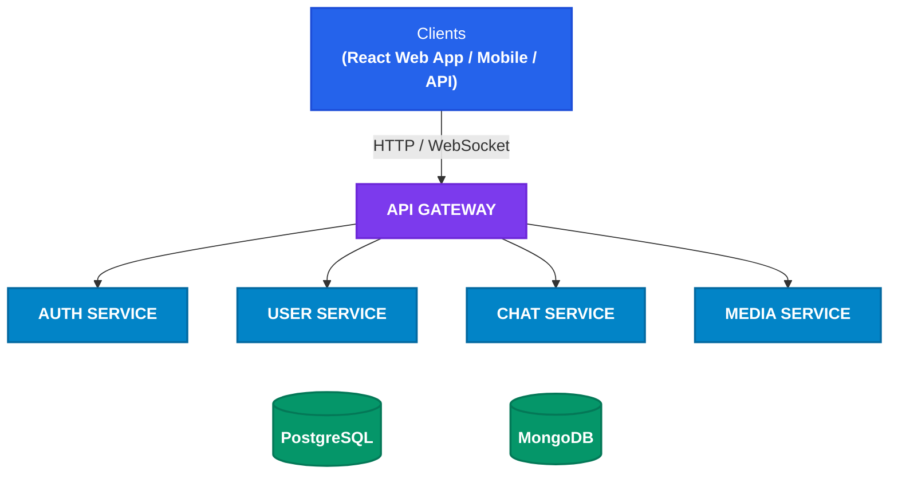

# System Architecture

## High-Level Design (HLD) - Draft

```mermaid
flowchart TD
    classDef client fill:#2563eb,stroke:#1d4ed8,stroke-width:2px,color:#fff;
    classDef gateway fill:#7c3aed,stroke:#6d28d9,stroke-width:2px,color:#fff;
    classDef service fill:#0284c7,stroke:#0369a1,stroke-width:2px,color:#fff;
    classDef storage fill:#059669,stroke:#047857,stroke-width:2px,color:#fff;

    CLIENTS["Clients<br/><b>(React Web App / Mobile / API)</b>"]:::client

    GATEWAY["<b>API GATEWAY</b>"]:::gateway

    AUTH["<b>AUTH SERVICE</b>"]:::service
    USER["<b>USER SERVICE</b>"]:::service
    CHAT["<b>CHAT SERVICE</b>"]:::service
    MEDIA["<b>MEDIA SERVICE</b>"]:::service

    POSTGRES[("<b>PostgreSQL</b>")]:::storage
    MONGO[("<b>MongoDB</b>")]:::storage

    CLIENTS -->|HTTP / WebSocket| GATEWAY

    GATEWAY --> AUTH
    GATEWAY --> USER
    GATEWAY --> CHAT
    GATEWAY --> MEDIA

    USER ~~~ POSTGRES
    CHAT ~~~ MONGO
```

