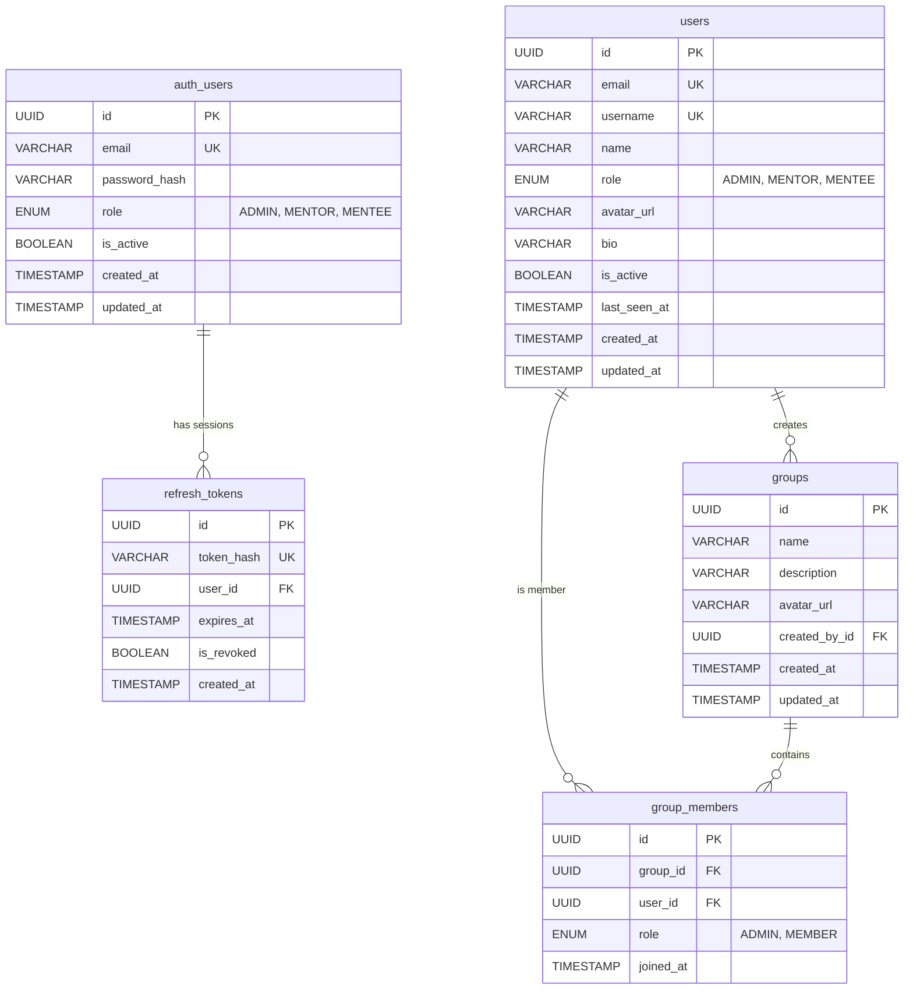

# 🏗️ Chat Portal — System Architecture & Design Specification

---

## 🧰 Tech Stack

| Layer | Technology | Rationale & Architectural Choice |
| :--- | :--- | :--- |
| **Backend Framework** | Node.js (v20+) / NestJS | TypeScript-first, modular Dependency Injection architecture, Single Responsibility Principle. |
| **API Gateway** | NestJS HTTP Reverse Proxy | Stateless JWT validation, request correlation, rate limiting, and WebSocket proxying. |
| **Real-Time Engine** | Socket.IO + `@socket.io/redis-adapter` | Low-latency bi-directional messaging, heartbeat keep-alive, automatic fallback, horizontal cluster pub/sub fanout. |
| **Message Ordering** | Monotonic ULID (Universally Unique Lexicographically Sortable ID) | 128-bit time-ordered IDs eliminating distributed lock bottlenecks for chronological cursors. |
| **Message Queue / Worker** | BullMQ + Redis | Decouples real-time WebSocket delivery path from write-heavy database persistence operations. |
| **Identity DB** | PostgreSQL 16 (via Prisma ORM) | ACID compliance, unique email/username constraints, refresh token revocation cascades. |
| **User & Groups DB** | PostgreSQL 16 (via Prisma ORM) | Relational integrity for user profiles, RBAC roles (`ADMIN`, `MENTOR`, `MENTEE`), and group memberships. |
| **Chat & History DB** | MongoDB 7.0 (via Mongoose) | High-write throughput, schema flexibility for attachments/doubts, chunk-based horizontal sharding. |
| **Cache & State Store** | Redis 7 (Alpine) | Active socket mapping, user presence heartbeats, BullMQ job queues, typing indicators. |
| **Object Storage** | MinIO (local dev) / AWS S3 (production) | Presigned URL generation, secure multi-part uploads for images, files, and blurhash thumbnails. |
| **Frontend Client** | React 19, Vite, TypeScript | Component-based interactive UI, real-time Socket.IO client, optimistic UI updates, doubt badges. |
| **Infrastructure / DevOps** | Docker Compose, Terraform, AWS EC2 | Multi-container dev & production profiles; Infrastructure as Code for automated AWS cloud provisioning. |

---

## 📐 Microservices Architecture

### Service Decomposition

```
┌──────────────────────────────────────────────────────────────────────────────────┐
│                           CLIENT TIER (React / Vite)                             │
└────────────────────────────────────────┬─────────────────────────────────────────┘
                                         │
                                         ▼
┌──────────────────────────────────────────────────────────────────────────────────┐
│                            API GATEWAY (Port 3000)                               │
│                                                                                  │
│  • Edge Authentication: Stateless JWT signature & expiration check               │
│  • Rate Limiting: Sliding-window rate limiter per IP / User                      │
│  • Transparent Reverse Proxying for REST endpoints                               │
│  • WebSocket Upgrade & Proxying to Chat Service (/socket.io)                     │
└───────┬───────────────────┬────────────────────┬──────────────────┬──────────────┘
        │                   │                    │                  │
        ▼                   ▼                    ▼                  ▼
  ┌───────────┐       ┌───────────┐        ┌───────────┐      ┌───────────┐
  │   AUTH    │       │   USER    │        │   CHAT    │      │   MEDIA   │
  │  SERVICE  │       │  SERVICE  │        │  SERVICE  │      │  SERVICE  │
  │(Port 3003)│       │(Port 3002)│        │(Port 3001)│      │(Port 3005)│
  └─────┬─────┘       └─────┬─────┘        └─────┬─────┘      └─────┬─────┘
        │                   │                    │                  │
        │                   │             ┌──────┴──────┐           │
        ▼                   ▼             ▼             ▼           ▼
  ┌───────────┐       ┌───────────┐ ┌───────────┐ ┌───────────┐┌───────────┐
  │PostgreSQL │       │PostgreSQL │ │   Redis   │ │  BullMQ   ││MinIO / S3 │
  │ (auth_db) │       │ (user_db) │ │(Presence) │ │ (Queues)  ││ (Bucket)  │
  └───────────┘       └───────────┘ └───────────┘ └─────┬─────┘└───────────┘
                                                        │
                                                        ▼
                                                  ┌───────────┐
                                                  │  WORKER   │
                                                  │  SERVICE  │
                                                  │(Port 3004)│
                                                  └─────┬─────┘
                                                        │ (Write)
                                                        ▼
                                                  ┌───────────┐
                                                  │  MongoDB  │
                                                  │ (chat_db) │
                                                  └───────────┘
```

### Why This Decomposition?

```
┌────────────────────────────────────────────────────────────────────────────────────────────────┐
│ Service               │ Scaling Driver          │ Traffic Ratio │ Primary Operations           │
├───────────────────────┼─────────────────────────┼───────────────┼──────────────────────────────┤
│ API Gateway           │ Connection Concurrency  │ 100% of Req   │ JWT verification, routing    │
│ Auth Service          │ Authentication Spikes   │ ~1% of Req    │ Login, register, token rot.  │
│ User Service          │ Read-Heavy Queries      │ ~10% of Req   │ Profiles, groups, contacts   │
│ Chat Service          │ Ultra-High Real-Time    │ ~80% of Req   │ WebSockets, ULIDs, presence  │
│ Message Worker        │ Asynchronous Write I/O  │ Background    │ BullMQ queue consumption     │
│ Media Service         │ High Network Bandwidth  │ ~5% of Req    │ Presigned URLs, S3 uploads   │
└────────────────────────────────────────────────────────────────────────────────────────────────┘
```

> **Scalability Note (Horizontal Scaling via Redis Adapter)**:
> Because the **Chat Service** handles ~80% of active traffic (persistent WebSocket connections, heartbeats, and live message fan-outs), it is architected for horizontal scalability across multiple replica nodes. Using `@socket.io/redis-adapter`, events are seamlessly synchronized across clustered nodes via Redis Pub/Sub — enabling users connected to different Chat Service instances to exchange messages with zero cross-node communication friction. Furthermore, write operations are completely decoupled into BullMQ background workers, ensuring the WebSocket event loop remains ultra-responsive under high concurrent load. [may need some work around edge cases to handle]

---

### Microservices Summary

| Service | Port | Primary Responsibility |
| :--- | :--- | :--- |
| **API Gateway** | `3000` | Edge reverse proxy, stateless JWT validation, IP rate limiting, and WebSocket proxying. |
| **Chat Service** | `3001` | WebSocket gateway, real-time message routing, user presence tracking, and chat REST APIs. |
| **User Service** | `3002` | Manages user profiles, role-based access control (Admin/Mentor/Mentee), and program group memberships. |
| **Auth Service** | `3003` | User registration, credential hashing with bcrypt, JWT token generation, and refresh token rotation. |
| **Message Worker** | `3004` | Asynchronous worker consuming BullMQ queues to persist messages and read receipts into MongoDB. |
| **Media Service** | `3005` | Generates presigned upload URLs and handles secure file attachment storage with MinIO/S3. |
| **Frontend Client** | `5173 / 8080` | React 19 single-page application providing real-time chat, doubt resolution, and media viewing. |

---

### Complete Event & Job Catalog

| Queue / Channel | Producer | Consumer | Data Payload | Responsibility |
| :--- | :--- | :--- | :--- | :--- |
| `bull:chat-persistence` | Chat Service | Message Worker | `{ messageId, conversationId, senderId, recipientId, groupId, content, attachments, replyTo, isDoubt, doubtTopic, doubtStatus, isAnnouncement, timestamp }` | Persist chat message to MongoDB without blocking WebSocket event loop. |
| `bull:read-persistence` | Chat Service | Message Worker | `{ conversationId, userId, lastReadMessageId, lastReadAt }` | Record last read watermark in MongoDB and recompute unread message counters. |
| `presence:user:{id}` | Chat Service | Chat Service | `{ isOnline: true/false, lastSeen: Date }` | Redis state tracking active user socket presence and broadcast changes. |
| `socket.io#/#...` | Chat Service | Chat Service Replicas | Socket.IO internal cluster events | Distribute WebSocket frames across multiple horizontal Chat Service instances. |

---

### PostgreSQL Relational Schema (Auth & User Services)


---

### MongoDB Document Schema (Chat & Persistence)

MongoDB powers high-speed message storage, thread replies, and cursor-based historical lookups.

#### 1. `messages` Collection

```javascript
{
  _id: ObjectId("66fcab0123456789abcdef01"),
  messageId: "01J98Z7YQK8VXM2P3Q1T8W6R7N", // Monotonic ULID
  conversationId: "group:8b341fbc-1845-429a-9e58-f54817a0ef19",
  clientMessageId: "fe31a980-82a1-4322-901b-c124982fa129",
  type: "group",                            // "direct" | "group"
  senderId: "user-1111-aaaa-bbbb-cccc",
  recipientId: null,
  groupId: "8b341fbc-1845-429a-9e58-f54817a0ef19",
  content: "Could someone clarify Dijkstra vs Bellman-Ford on negative weights?",
  attachments: [
    {
      fileId: "file-9988-7766",
      type: "image",
      url: "https://storage.chatportal.io/media/file-9988-7766.png",
      thumbnailUrl: "https://storage.chatportal.io/media/thumb-9988-7766.png",
      fileName: "graph_weights.png",
      fileSize: 452100,
      mimeType: "image/png",
      width: 1280,
      height: 720,
      blurhash: "L6PZfSi_.AyE_3t7t7R**0o#DgR4"
    }
  ],
  status: "sent",                           // "sent" | "delivered" | "read"
  isAnnouncement: false,
  heading: null,
  replyTo: {
    messageId: "01J98Y5WNK3PXN9L2K8T5W1R2M",
    senderId: "user-2222-dddd-eeee-ffff",
    text: "Review the shortest path lecture slides"
  },
  isDoubt: true,
  doubtStatus: "OPEN",                      // "OPEN" | "RESOLVED"
  doubtTopic: "Graph Algorithms",
  resolvedBy: null,
  resolvedByName: null,
  resolvedAt: null,
  timestamp: ISODate("2026-10-02T12:00:00.000Z")
}
```

* **Indexes**:
  - `{ conversationId: 1, messageId: -1 }`: **Primary historical cursor query index**.
  - `{ messageId: 1 }` (`unique: true`): Enforces universal message uniqueness.
  - `{ "replyTo.messageId": 1 }` (`sparse: true`): Quick lookup for threaded reply chains.

#### 2. `conversation_reads` Collection

```javascript
{
  _id: ObjectId("66fcab0123456789abcdef02"),
  conversationId: "group:8b341fbc-1845-429a-9e58-f54817a0ef19",
  userId: "user-1111-aaaa-bbbb-cccc",
  lastReadMessageId: "01J98Z7YQK8VXM2P3Q1T8W6R7N",
  lastReadAt: ISODate("2026-10-02T12:05:00.000Z"),
  unreadCount: 0
}
```
* **Indexes**:
  - `{ conversationId: 1, userId: 1 }` (`unique: true`): One read state per user per room.
  - `{ userId: 1, unreadCount: 1 }`: Fetch conversation list ordered by unread urgency.

#### 3. `pinned_messages` Collection

```javascript
{
  _id: ObjectId("66fcab0123456789abcdef03"),
  conversationId: "group:8b341fbc-1845-429a-9e58-f54817a0ef19",
  messageId: "01J98Z7YQK8VXM2P3Q1T8W6R7N",
  pinnedBy: "user-admin-uuid",
  pinnedByName: "Alex Instructor",
  pinnedAt: ISODate("2026-10-02T12:10:00.000Z"),
  snapshot: {
    senderId: "user-1111-aaaa-bbbb-cccc",
    content: "Project submission link and instructions",
    isAnnouncement: true,
    timestamp: ISODate("2026-10-02T12:00:00.000Z")
  }
}
```
* **Indexes**:
  - `{ conversationId: 1, messageId: 1 }` (`unique: true`): Prevent duplicate pins.
  - `{ conversationId: 1, pinnedAt: -1 }`: Sorted newest pin first.

#### 4. `reported_messages` Collection

```javascript
{
  _id: ObjectId("66fcab0123456789abcdef04"),
  messageId: "01J98Z7YQK8VXM2P3Q1T8W6R7N",
  conversationId: "group:8b341fbc-1845-429a-9e58-f54817a0ef19",
  reportedBy: "user-mentee-uuid",
  reason: "Spam / inappropriate promotional content",
  status: "PENDING",                        // "PENDING" | "REVIEWED" | "DISMISSED"
  message: { /* Full immutable snapshot of reported message */ },
  createdAt: ISODate("2026-10-02T12:15:00.000Z")
}
```
* **Indexes**:
  - `{ messageId: 1, reportedBy: 1 }` (`unique: true`): Deduplicate repeated reports.
  - `{ createdAt: -1 }`: Moderation backlog sorting.

---

### Redis Data Structures & Key Layout

```
# 1. User Online Status & Presence
Key: presence:user:{userId}
Type: STRING / HASH
Value: { "isOnline": "1", "lastSeen": "2026-10-02T12:14:00Z" }
TTL: 60s (Refreshed continuously by client heartbeat every 30s)

# 2. BullMQ Job Queues (Stream / Hash / ZSet)
Key: bull:chat-persistence:id
Key: bull:chat-persistence:waiting
Key: bull:read-persistence:waiting
Managed directly by BullMQ Redis engine

# 3. Socket.IO Inter-Node Pub/Sub
Key: socket.io#/#
Type: Pub/Sub Channel
Role: Fanout broadcasting of room frames across clustered gateway pods
```

---

## 🔌 REST API Endpoints Reference

### API Gateway (Port 3000)

All external client traffic routes through `http://localhost:3000`.

### Auth Service (`/api/auth`)

| Method | Endpoint | Description |
| :--- | :--- | :--- |
| `POST` | `/api/auth/register` | Register new user account (`email`, `password`, `role`) |
| `POST` | `/api/auth/login` | Authenticate with credentials; returns Access JWT + Refresh Token |
| `POST` | `/api/auth/refresh` | Exchange valid refresh token for a new Access JWT |
| `POST` | `/api/auth/logout` | Revoke active refresh token session |
| `GET` | `/api/auth/me` | Fetch active authenticated user identity |

### User Service (`/api/users` & `/api/groups`)

| Method | Endpoint | Description |
| :--- | :--- | :--- |
| `POST` | `/api/users` | Internal provisioning of user profile |
| `GET` | `/api/users` | List/search user profiles |
| `GET` | `/api/users/:id` | Fetch specific user profile details |
| `PATCH`| `/api/users/:id/last-seen` | Update user last active timestamp |
| `POST` | `/api/groups` | Create new collaboration group |
| `GET` | `/api/groups` | List user's active groups |
| `GET` | `/api/groups/:id` | Fetch group metadata and details |
| `GET` | `/api/groups/:id/member-ids` | List member user IDs of a group |
| `POST` | `/api/groups/:id/members` | Add new member to group (Admin only) |
| `DELETE`| `/api/groups/:id/members/:userId` | Remove member from group |

### Chat Service (`/api/chat` / `/api/messages`)

| Method | Endpoint | Description |
| :--- | :--- | :--- |
| `GET` | `/api/chat/messages/direct/:userId` | Cursor-paginated history for direct conversation (`before`, `limit`) |
| `GET` | `/api/chat/messages/group/:groupId` | Cursor-paginated history for group conversation |
| `GET` | `/api/chat/messages/context` | Fetch context window of messages surrounding a specific `messageId` |
| `GET` | `/api/chat/messages/unread-counts` | List aggregated unread message counters per conversation |
| `GET` | `/api/chat/messages/doubts` | List categorized doubts for a room (`status`: `OPEN` / `RESOLVED`) |
| `PATCH`| `/api/chat/messages/:messageId/doubt-status` | Update doubt status (`OPEN` or `RESOLVED`, Mentors/Admins only) |
| `GET` | `/api/chat/messages/pins` | Fetch all pinned messages for a conversation |
| `POST` | `/api/chat/messages/:messageId/pin` | Pin a message (with snapshot) |
| `DELETE`| `/api/chat/messages/:messageId/pin` | Unpin a message |
| `POST` | `/api/chat/messages/:messageId/report` | Submit an abuse or moderation report |
| `GET` | `/api/chat/messages/reports` | List submitted moderation reports (Admin only) |

### Media Service (`/api/media`)

| Method | Endpoint | Description |
| :--- | :--- | :--- |
| `POST` | `/api/media/upload-url` | Generate presigned S3/MinIO upload URL + permanent fileId |
| `GET` | `/api/media/info` | Fetch media file metadata |
| `DELETE`| `/api/media/file` | Delete media object from storage |

---

## ⚡ Socket.IO Events Reference

All real-time communication occurs over WebSocket connected to `/socket.io`.

### Client → Server Events

| Event Name | Payload Structure | Description |
| :--- | :--- | :--- |
| `send_direct_message` | `{ recipientId, message, attachments, clientMessageId, isDoubt, doubtTopic, replyTo }` | Send direct message to peer. |
| `send_group_message` | `{ groupId, message, attachments, clientMessageId, isAnnouncement, heading, isDoubt, doubtTopic, replyTo }` | Send group message to room. |
| `update_doubt_status` | `{ conversationId, messageId, status: 'OPEN' \| 'RESOLVED' }` | Resolve or reopen a doubt. |
| `delete_message` | `{ messageId }` | Delete message (soft-delete). |
| `mark_read` | `{ conversationId, lastReadMessageId }` | Advance user read watermark. |
| `ack_delivery` | `{ conversationId, messageId }` | Confirm receipt by recipient device. |
| `typing_start` | `{ recipientId?, groupId? }` | User started typing indicator. |
| `typing_stop` | `{ recipientId?, groupId? }` | User stopped typing indicator. |
| `subscribe_user_presence`| `{ targetUserId }` | Subscribe to peer presence updates. |
| `subscribe_group_presence`| `{ groupId }` | Subscribe to group presence updates. |
| `user_logout` | `{}` | Graceful disconnect & status flush. |

### Server → Client Events

| Event Name | Payload Structure | Description |
| :--- | :--- | :--- |
| `new_message` | `NewMessageEvent` (ULID `id`, `conversationId`, `content`, `attachments`, `timestamp`) | Inbound direct message received. |
| `new_group_message` | `GroupMessageEvent` (ULID `id`, `groupId`, `senderId`, `content`, ...) | Inbound group message received. |
| `doubt_status_changed`| `{ conversationId, messageId, status, resolvedBy, resolvedByName, resolvedAt }` | Doubt resolution state update. |
| `messages_read` | `{ conversationId, readerId, lastReadMessageId, readAt }` | Read receipt confirmation. |
| `message_delivered` | `{ conversationId, messageId, recipientId, deliveredAt }` | Delivery receipt confirmation. |
| `message_pinned` | `{ conversationId, pin: { id, messageId, pinnedBy, snapshot, pinnedAt } }` | New message pinned broadcast. |
| `message_unpinned` | `{ conversationId, messageId }` | Message unpinned broadcast. |
| `message_deleted` | `{ conversationId, messageId, deletedBy }` | Message deletion broadcast. |
| `user_typing` | `{ userId, isTyping: true/false, recipientId?, groupId? }` | Real-time typing notification. |
| `user_presence_changed`| `{ userId, isOnline: true/false, lastSeen }` | User presence transition broadcast. |
| `group_presence_changed`| `{ groupId, userId, isOnline }` | Group member status change. |

---

## 🚀 Deployment Topology & Infrastructure

### Multi-Container Production Topology (`docker-compose.prod.yml`)

```
┌──────────────────────────────────────────────────────────────────────────────┐
│                            PRODUCTION CONTAINER CLUSTER                      │
├──────────────────────────────────────────────────────────────────────────────┤
│                                                                              │
│  [ Reverse Proxy / Load Balancer ]                                           │
│  └─ API Gateway (NestJS) ─────── Port 3000 (Public Exposure)                 │
│                                                                              │
│  [ Clustered Microservices ]                                                 │
│  ├─ Auth Service ────────────── Port 3001 (Internal Network)                 │
│  ├─ User Service ────────────── Port 3002 (Internal Network)                 │
│  ├─ Chat Service ────────────── Port 3003 (Internal Network, WS Clustered)   │
│  ├─ Message Worker ──────────── Port 3004 (Internal Worker Process)          │
│  └─ Media Service ───────────── Port 3005 (Internal Network)                 │
│                                                                              │
│  [ Infrastructure & Persistence Layer ]                                      │
│  ├─ PostgreSQL 16 ───────────── Port 5432 (Persistent Volume)                │
│  ├─ MongoDB 7.0 ─────────────── Port 27017 (Persistent Volume)               │
│  ├─ Redis 7 Alpine ──────────── Port 6379 (In-Memory + AOF Volume)           │
│                                                                              │
└──────────────────────────────────────────────────────────────────────────────┘
```

### Infrastructure as Code (Terraform)

The root [`terraform/`](file:///Users/vishalsinha/Documents/chat-portal/terraform) directory contains automated cloud provisioning scripts for AWS:
* **`main.tf`**: Provisions AWS VPC, subnets, Internet Gateways, Security Groups, and EC2 compute instances.
* **`user_data.sh.tpl`**: Automated bootstrap shell script provisioning Docker, Docker Compose, system dependencies, and repository cloning upon EC2 startup.
* **`variables.tf`**: Configurable cloud variables (`aws_region`, `instance_type`, `key_name`, `vpc_cidr`).

