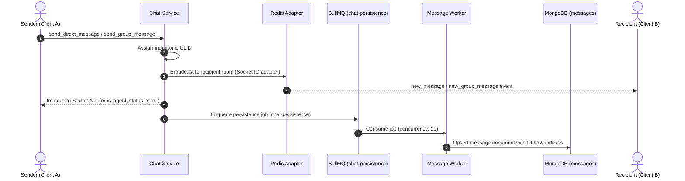
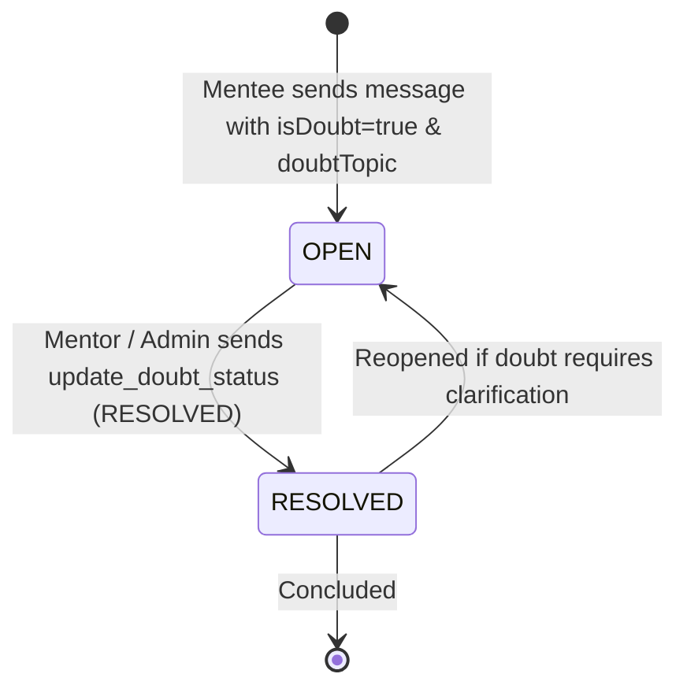
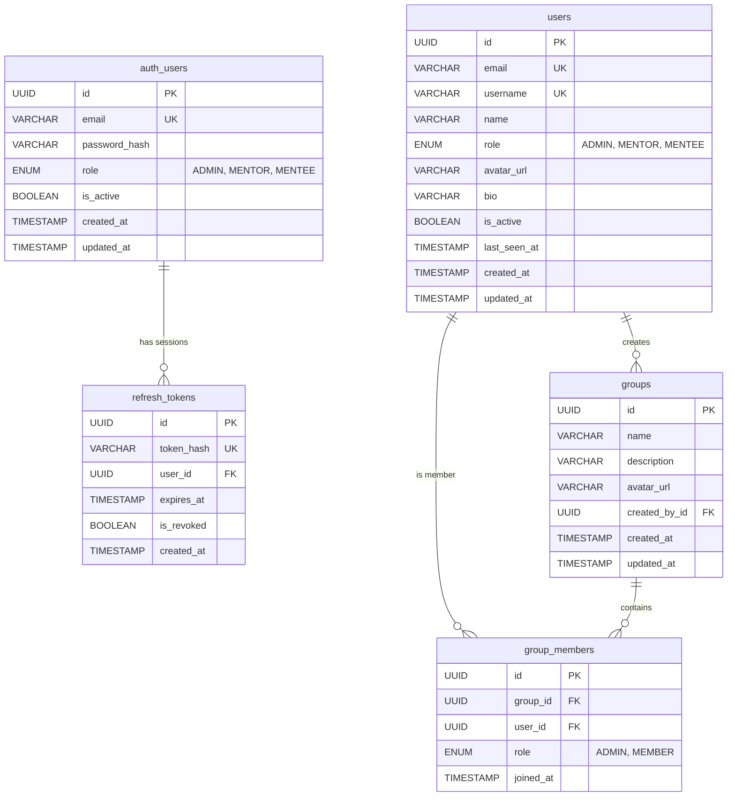

# 🏗️ Chat Portal — System Architecture & Design Specification

> A production-grade, event-driven microservices platform designed for real-time collaboration, mentor-mentee doubt resolution, group interactions, media streaming, and asynchronous high-throughput persistence.

---

## 📑 Table of Contents

1. [Tech Stack](#-tech-stack)
2. [Microservices Architecture](#-microservices-architecture)
   - [Service Decomposition](#service-decomposition)
   - [Why This Decomposition?](#why-this-decomposition)
3. [Inter-Service Communication](#-inter-service-communication)
   - [Synchronous Communication (Internal HTTP/REST)](#synchronous-communication-internal-httprest)
   - [Asynchronous Event Bus & Job Queues (BullMQ + Redis)](#asynchronous-event-bus--job-queues-bullmq--redis)
   - [Complete Event & Job Catalog](#complete-event--job-catalog)
4. [API Gateway — Stateless Edge Authentication & Routing](#-api-gateway--stateless-edge-authentication--routing)
   - [Stateless JWT Verification](#stateless-jwt-verification)
   - [Sliding-Window Rate Limiting](#sliding-window-rate-limiting)
   - [Reverse Proxy & WebSocket Upgrade](#reverse-proxy--websocket-upgrade)
5. [Chat Service & Real-Time Messaging Engine](#-chat-service--real-time-messaging-engine)
   - [Monotonic ULID Message Identifier](#monotonic-ulid-message-identifier)
   - [Socket.IO Clustering with Redis Adapter](#socketio-clustering-with-redis-adapter)
   - [Room-Based Isolation & Conversation IDs](#room-based-isolation--conversation-ids)
   - [Read Receipts & Unread Count Tracking](#read-receipts--unread-count-tracking)
6. [Specialized Collaboration Subsystems](#-specialized-collaboration-subsystems)
   - [Mentor-Mentee Doubt Resolution Workflow](#mentor-mentee-doubt-resolution-workflow)
   - [Announcements & Message Pinning Subsystem](#announcements--message-pinning-subsystem)
   - [Abuse Reporting & Moderation Subsystem](#abuse-reporting--moderation-subsystem)
   - [Media & Storage Pipeline (Presigned S3/MinIO)](#media--storage-pipeline-presigned-s3minio)
7. [Database Architecture & Data Models](#-database-architecture--data-models)
   - [Database Ownership Rule](#database-ownership-rule)
   - [PostgreSQL Relational Schema (Auth & User Services)](#postgresql-relational-schema-auth--user-services)
   - [MongoDB Document Schema (Chat & Persistence)](#mongodb-document-schema-chat--persistence)
   - [Redis Data Structures & Key Layout](#redis-data-structures--key-layout)
8. [Database Scaling & Sharding Strategies](#-database-scaling--sharding-strategies)
   - [MongoDB Chunk-Based Sharding (Chat History)](#mongodb-chunk-based-sharding-chat-history)
   - [PostgreSQL Scaling (Read Replicas & Connection Pooling)](#postgresql-scaling-read-replicas--connection-pooling)
   - [Redis Clustering & Slot Allocation](#redis-clustering--slot-allocation)
9. [REST API Endpoints Reference](#-rest-api-endpoints-reference)
10. [Socket.IO Events Reference](#-socketio-events-reference)
11. [Security, RBAC & Protection Controls](#-security-rbac--protection-controls)
12. [Deployment Topology & Infrastructure](#-deployment-topology--infrastructure)
13. [Architectural Highlights & Interview Talking Points](#-architectural-highlights--interview-talking-points)

---

## 🧰 Tech Stack

| Layer | Technology | Rationale & Architectural Choice |
| :--- | :--- | :--- |
| **Backend Framework** | Node.js (v20+) / NestJS | TypeScript-first, modular Dependency Injection architecture, Single Responsibility Principle. |
| **API Gateway** | NestJS HTTP Reverse Proxy (`express-http-proxy` / `http-proxy-middleware`) | Edge SSL termination, stateless JWT validation, request correlation, rate limiting, and WebSocket proxying. |
| **Real-Time Engine** | Socket.IO + `@socket.io/redis-adapter` | Low-latency bi-directional messaging, heartbeat keep-alive, automatic fallback, horizontal cluster pub/sub fanout. |
| **Message Ordering** | Monotonic ULID (Universally Unique Lexicographically Sortable ID) | 128-bit time-ordered IDs eliminating distributed lock bottlenecks for chronological cursors. |
| **Message Queue / Worker** | BullMQ + Redis | Decouples real-time WebSocket delivery path from write-heavy database persistence operations. |
| **Identity DB** | PostgreSQL 16 (via Prisma ORM) | ACID compliance, unique email/username constraints, refresh token revocation cascades. |
| **User & Groups DB** | PostgreSQL 16 (via Prisma ORM) | Relational integrity for user profiles, RBAC roles (`ADMIN`, `MENTOR`, `MENTEE`), and group memberships. |
| **Chat & History DB** | MongoDB 7.0 (via Mongoose) | High-write throughput, schema flexibility for attachments/doubts, chunk-based horizontal sharding. |
| **Cache & State Store** | Redis 7 (Alpine) | Active socket mapping, user presence heartbeats, BullMQ job queues, typing indicators. |
| **Object Storage** | MinIO (local dev) / AWS S3 (production) | Presigned URL generation, secure multi-part uploads for images, files, and blurhash thumbnails. |
| **Frontend Client** | React 18, Vite, TypeScript | Component-based interactive UI, real-time Socket.IO client, optimistic UI updates, doubt badges. |
| **Infrastructure / DevOps** | Docker Compose, Terraform, AWS EC2 | Multi-container dev & production profiles; Infrastructure as Code for automated AWS cloud provisioning. |

---

## 📐 Microservices Architecture

### Service Decomposition

```
┌────────────────────────────────────────────────────────────────────────────────────────┐
│                                CLIENT TIER (React / Vite)                              │
│                    • Direct & Group Messaging   • Doubt Resolution UI                  │
│                    • Media & Attachment Uploads • Presence & Typing Indicators         │
└───────────────────────────────────────────┬────────────────────────────────────────────┘
                                            │
                                            ▼
┌────────────────────────────────────────────────────────────────────────────────────────┐
│                               🔀 API GATEWAY (Port 3000)                               │
│                                                                                        │
│  • Edge Authentication: Stateless JWT signature & expiration check                     │
│  • Rate Limiting: Sliding-window rate limiter per IP / User                            │
│  • Request Logging & Correlation ID propagation (`x-correlation-id`, `x-user-id`)      │
│  • Transparent Reverse Proxying for REST endpoints                                    │
│  • WebSocket Upgrade & Proxying to Chat Service (`/socket.io`)                         │
└───────┬──────────────┬──────────────┬────────────────────────┬─────────────┬───────────┘
        │              │              │                        │             │
        ▼              ▼              ▼                        ▼             ▼
  ┌───────────┐  ┌───────────┐  ┌───────────┐            ┌───────────┐ ┌───────────┐
  │  🔐 AUTH   │  │  👤 USER   │  │  💬 CHAT   │            │ 📁 MEDIA  │ │ ⚙️ WORKER  │
  │  SERVICE  │  │  SERVICE  │  │  SERVICE  │            │  SERVICE  │ │  SERVICE  │
  │  Port 3001│  │  Port 3002│  │  Port 3003│            │  Port 3005│ │  Port 3004│
  └─────┬─────┘  └─────┬─────┘  └─────┬─────┘            └─────┬─────┘ └─────┬─────┘
        │              │              │                        │             │
        │              │              ├──────────┐             │             │
        ▼              ▼              ▼          ▼             ▼             ▼
  ┌───────────┐  ┌───────────┐  ┌───────────┐ ┌─────────┐ ┌──────────┐ ┌───────────┐
  │PostgreSQL │  │PostgreSQL │  │   Redis   │ │ BullMQ  │ │MinIO / S3│ │  MongoDB  │
  │(auth_db)  │  │ (user_db) │  │ (Presence/│ │ (Job    │ │ (Media   │ │ (chat_db) │
  │           │  │           │  │  Adapter) │ │  Queues)│ │  Bucket) │ │           │
  └───────────┘  └───────────┘  └───────────┘ └────┬────┘ └──────────┘ └─────▲─────┘
                                                   │                         │
                                                   └─────────────────────────┘
```

### Why This Decomposition?

```
┌────────────────────────────────────────────────────────────────────────────────────────────────┐
│ Service               │ Scaling Driver          │ Traffic Ratio │ Primary Operations           │
├───────────────────────┼─────────────────────────┼───────────────┼──────────────────────────────┤
│ API Gateway           │ Connection Concurrency  │ 100% of Req   │ JWT verification, routing    │
│ Auth Service          │ Authentication Spikes   │ ~1% of Req    │ Login, register, token rot.  │
│ User Service          │ Read-Heavy Queries      │ ~10% of Req   │ Profiles, groups, contacts   │
│ Chat Service          │ Ultra-High Real-Time    │ ~80% of Req   │ WebSockets, ULIDs, presence  │
│ Message Worker        │ Asynchronous Write I/O  │ Background    │ BullMQ queue consumption     │
│ Media Service         │ High Network Bandwidth  │ ~5% of Req    │ Presigned URLs, S3 uploads   │
└────────────────────────────────────────────────────────────────────────────────────────────────┘
```

---

## 🔄 Inter-Service Communication

### Synchronous Communication (Internal HTTP/REST)

Internal synchronous calls are performed strictly when immediate data validation or identity metadata is required across service boundaries:

```
┌──────────────┐     HTTP: GET /api/users/:userId           ┌──────────────┐
│ Chat Service │ ─────────────────────────────────────────▶ │ User Service │
└──────────────┘ ◀─── { id, name, username, role, ... } ──── └──────────────┘

┌──────────────┐     HTTP: GET /api/users/groups/:id/members┌──────────────┐
│ Chat Service │ ─────────────────────────────────────────▶ │ User Service │
└──────────────┘ ◀─── { groupId, memberIds: [...] } ──────── └──────────────┘

┌──────────────┐     HTTP: PATCH /api/users/:id/last-seen   ┌──────────────┐
│ Chat Service │ ─────────────────────────────────────────▶ │ User Service │
└──────────────┘ ◀─── { success: true } ──────────────────── └──────────────┘
```

### Asynchronous Event Bus & Job Queues (BullMQ + Redis)

Message persistence is **completely removed from the WebSocket hot path**. When a message is sent over Socket.IO:
1. Chat Service verifies authorization and immediately broadcasts to the room via the Redis adapter.
2. An asynchronous job is dispatched to BullMQ.
3. Message Worker consumes the job in batches and persists it to MongoDB.



### Complete Event & Job Catalog

| Queue / Channel | Producer | Consumer | Data Payload | Responsibility |
| :--- | :--- | :--- | :--- | :--- |
| `bull:chat-persistence` | Chat Service | Message Worker | `{ messageId, conversationId, senderId, recipientId, groupId, content, attachments, replyTo, isDoubt, doubtTopic, doubtStatus, isAnnouncement, timestamp }` | Persist chat message to MongoDB without blocking WebSocket event loop. |
| `bull:read-persistence` | Chat Service | Message Worker | `{ conversationId, userId, lastReadMessageId, lastReadAt }` | Record last read watermark in MongoDB and recompute unread message counters. |
| `presence:user:{id}` | Chat Service | Chat Service | `{ isOnline: true/false, lastSeen: Date }` | Redis state tracking active user socket presence and broadcast changes. |
| `socket.io#/#...` | Chat Service | Chat Service Replicas | Socket.IO internal cluster events | Distribute WebSocket frames across multiple horizontal Chat Service instances. |

---

## 🔑 API Gateway — Stateless Edge Authentication & Routing

### Stateless JWT Verification

The API Gateway completely eliminates network hops to Auth Service on every inbound API call by performing local cryptographic validation using a shared HMAC-SHA256 secret:

```
┌────────────────────────────────────────────────────────────────────────┐
│                        API GATEWAY INBOUND REQUEST                     │
├────────────────────────────────────────────────────────────────────────┤
│ 1. Request arrives: e.g. GET /api/users/profile                        │
│    Header: Authorization: Bearer <jwt-access-token>                    │
│                                                                        │
│ 2. Gateway Auth Middleware executes locally:                          │
│    jwt.verify(token, JWT_ACCESS_SECRET)                                │
│    • Checks signature integrity                                        │
│    • Validates expiration time (`exp`)                                 │
│    • Extracts payload: { sub: "<userId>", email, role }                │
│    • Execution latency: < 0.2ms (Zero network round-trips)             │
│                                                                        │
│ 3. Inject identity headers into downstream proxy request:              │
│    x-user-id: <sub/userId>                                             │
│    x-user-role: <role>                                                 │
│    x-correlation-id: <uuid>                                            │
│                                                                        │
│ 4. Forward to downstream microservice (User, Chat, Media)              │
└────────────────────────────────────────────────────────────────────────┘
```

### Sliding-Window Rate Limiting

The API Gateway enforces rate limiting via configurable in-memory/Redis sliding windows before routing requests downstream:
* **Standard Threshold**: 100 requests / 60 seconds per IP / User.
* **Health Checks**: `/health`, `/api/*/health` bypass the limiter for container orchestrator liveness probes.

### Reverse Proxy & WebSocket Upgrade

The Gateway maps public endpoints cleanly to decoupled downstream internal services:

```typescript
// Gateway Route Mapping
const ROUTE_PROXY_MAP = {
  '/api/auth/**':    'http://auth-service:3001',   // Auth Service
  '/api/users/**':   'http://user-service:3002',   // User & Groups Service
  '/api/chat/**':    'http://chat-service:3003',   // Chat Service (HTTP History)
  '/api/media/**':   'http://media-service:3005',  // Media Uploads
  '/socket.io/**':   'ws://chat-service:3003',     // WebSocket Proxy (Upgrade: websocket)
};
```

---

## 💬 Chat Service & Real-Time Messaging Engine

### Monotonic ULID Message Identifier

Traditional auto-incrementing integers cannot scale across distributed clusters, and standard random UUIDv4 identifiers destroy B-Tree index locality in databases.

The system uses **Monotonic ULID (Universally Unique Lexicographically Sortable Identifier)**:
* **48-bit Timestamp**: Millisecond precision giving chronological ordering.
* **80-bit Cryptographic Randomness**: Guarantees zero collisions across concurrent instances.
* **Lexicographical Sortability**: String comparison `A < B` is identical to chronological ordering `t(A) < t(B)`.
* **Sub-millisecond Monotonicity**: When multiple messages are generated within the exact same millisecond, the random component increments monotonically.

```
┌───────────────────────────────── 128 Bits ─────────────────────────────────┐
│        48-Bit Timestamp (6 Bytes)       │       80-Bit Random (10 Bytes)     │
│   e.g. 01ARZ3NDEK (2026-10-02 12:00)    │       TSV4RRFFQ69G5FAV             │
└─────────────────────────────────────────┴────────────────────────────────────┘
```

### Socket.IO Clustering with Redis Adapter

To scale WebSocket connections across multiple chat nodes, the Chat Service integrates `@socket.io/redis-adapter`:
* Node A and Node B connect to the shared Redis instance.
* When User A on Node A sends a message to a room joined by User B on Node B, Socket.IO publishes a lightweight Redis Pub/Sub event.
* Node B receives the Redis event and flushes it down the WebSocket connection to User B.

### Room-Based Isolation & Conversation IDs

The system standardizes deterministic room names:
* **Direct Chat Conversation ID**: `direct:${[userId1, userId2].sort().join(':')}`
* **Group Chat Conversation ID**: `group:${groupId}`
* **User Personal Presence Room**: `presence:user:${userId}`
* **Group Presence Room**: `presence:group:${groupId}`

### Read Receipts & Unread Count Tracking

Read tracking is managed via a **high-watermark cursor model**:
1. When a user opens a conversation, the client emits `mark_read` with `lastReadMessageId`.
2. Chat Service acknowledges the read state and pushes a `read-persistence` task to BullMQ.
3. Message Worker updates the user's `conversation_reads` record:
   - Sets `lastReadMessageId` to the latest message ULID.
   - Updates `lastReadAt`.
   - Computes remaining unread messages: `count({ conversationId, messageId: { $gt: lastReadMessageId } })`.

---

## 🎯 Specialized Collaboration Subsystems

### Mentor-Mentee Doubt Resolution Workflow

Designed specifically for educational and structured mentorship platforms:



1. **Doubt Creation**: Any mentee or participant can send a message flagged with `isDoubt: true` and a categorized `doubtTopic` (e.g., `"Algorithms"`, `"System Design"`).
2. **Doubt Indexing**: Optimized compound index `{ conversationId: 1, isDoubt: 1, doubtStatus: 1 }` allows mentors to filter open queries instantly.
3. **Resolution**: Only users with `ROLE: MENTOR` or `ROLE: ADMIN` are authorized to resolve doubts. When resolved, the system records `resolvedBy`, `resolvedByName`, and `resolvedAt`, broadcasting `doubt_status_changed` to all room participants.

### Announcements & Message Pinning Subsystem

* **Announcements**: Special broadcast messages marked with `isAnnouncement: true` and an optional `heading`.
* **Pinned Messages**: Important messages or announcements can be pinned in direct or group chats:
  - Stored in a dedicated `pinned_messages` collection.
  - Takes an **immutable snapshot** of the message content and author at pin time.
  - Ensures pinned messages remain renderable even if the original message history is archived.

### Abuse Reporting & Moderation Subsystem

* Users can submit violation reports against any message with a documented `reason`.
* Persisted in `reported_messages` with status: `PENDING`, `REVIEWED`, or `DISMISSED`.
* Captures a snapshot of the sender, conversation, and attachment payload for admin investigation.

### Media & Storage Pipeline (Presigned S3/MinIO)

To prevent media uploads from saturating API Gateway or Chat Service memory, the system uses direct-to-storage presigned URLs:

```
1. Client requests upload URL:
   POST /api/media/upload-url { fileName, mimeType, fileSize }
2. Media Service validates constraints (max file size, allowed MIME types).
3. Media Service generates presigned S3/MinIO upload URL + permanent fileId.
4. Client uploads raw binary directly to S3 / MinIO.
5. Client attaches metadata { fileId, url, mimeType, blurhash } to chat message.
```

---

## 🗃️ Database Architecture & Data Models

### Database Ownership Rule

> **Strict Database Ownership Boundary**: No service connects directly to another service's primary database. All inter-service data dependencies are resolved via HTTP REST APIs or asynchronous BullMQ queues.

---

### PostgreSQL Relational Schema (Auth & User Services)



#### SQL DDL Definitions

```sql
-- ============================================================================
-- AUTH SERVICE SCHEMA (auth_db)
-- ============================================================================
CREATE TYPE "Role" AS ENUM ('ADMIN', 'MENTOR', 'MENTEE');

CREATE TABLE "auth_users" (
    "id"            UUID PRIMARY KEY DEFAULT gen_random_uuid(),
    "email"         VARCHAR(255) UNIQUE NOT NULL,
    "password_hash" VARCHAR(255) NOT NULL,
    "role"          "Role" NOT NULL DEFAULT 'MENTEE',
    "is_active"     BOOLEAN NOT NULL DEFAULT true,
    "created_at"    TIMESTAMP WITH TIME ZONE NOT NULL DEFAULT NOW(),
    "updated_at"    TIMESTAMP WITH TIME ZONE NOT NULL DEFAULT NOW()
);

CREATE TABLE "refresh_tokens" (
    "id"            UUID PRIMARY KEY DEFAULT gen_random_uuid(),
    "token_hash"    VARCHAR(255) UNIQUE NOT NULL,
    "user_id"       UUID NOT NULL REFERENCES "auth_users"("id") ON DELETE CASCADE,
    "expires_at"    TIMESTAMP WITH TIME ZONE NOT NULL,
    "is_revoked"    BOOLEAN NOT NULL DEFAULT false,
    "created_at"    TIMESTAMP WITH TIME ZONE NOT NULL DEFAULT NOW()
);

CREATE INDEX "idx_refresh_tokens_user" ON "refresh_tokens"("user_id");

-- ============================================================================
-- USER SERVICE SCHEMA (user_db)
-- ============================================================================
CREATE TABLE "users" (
    "id"            UUID PRIMARY KEY DEFAULT gen_random_uuid(),
    "email"         VARCHAR(255) UNIQUE NOT NULL,
    "username"      VARCHAR(100) UNIQUE NOT NULL,
    "name"          VARCHAR(255),
    "role"          "Role" NOT NULL DEFAULT 'MENTEE',
    "avatar_url"    TEXT,
    "bio"           TEXT,
    "is_active"     BOOLEAN NOT NULL DEFAULT true,
    "last_seen_at"  TIMESTAMP WITH TIME ZONE,
    "created_at"    TIMESTAMP WITH TIME ZONE NOT NULL DEFAULT NOW(),
    "updated_at"    TIMESTAMP WITH TIME ZONE NOT NULL DEFAULT NOW()
);

CREATE TYPE "GroupRole" AS ENUM ('ADMIN', 'MEMBER');

CREATE TABLE "groups" (
    "id"            UUID PRIMARY KEY DEFAULT gen_random_uuid(),
    "name"          VARCHAR(255) NOT NULL,
    "description"   TEXT,
    "avatar_url"    TEXT,
    "created_by_id" UUID NOT NULL,
    "created_at"    TIMESTAMP WITH TIME ZONE NOT NULL DEFAULT NOW(),
    "updated_at"    TIMESTAMP WITH TIME ZONE NOT NULL DEFAULT NOW()
);

CREATE TABLE "group_members" (
    "id"            UUID PRIMARY KEY DEFAULT gen_random_uuid(),
    "group_id"      UUID NOT NULL REFERENCES "groups"("id") ON DELETE CASCADE,
    "user_id"       UUID NOT NULL REFERENCES "users"("id") ON DELETE CASCADE,
    "role"          "GroupRole" NOT NULL DEFAULT 'MEMBER',
    "joined_at"     TIMESTAMP WITH TIME ZONE NOT NULL DEFAULT NOW(),
    CONSTRAINT "uq_group_member" UNIQUE ("group_id", "user_id")
);

CREATE INDEX "idx_group_members_user" ON "group_members"("user_id");
CREATE INDEX "idx_group_members_group" ON "group_members"("group_id");
```

---

### MongoDB Document Schema (Chat & Persistence)

MongoDB powers high-speed message storage, thread replies, and cursor-based historical lookups.

#### 1. `messages` Collection

```javascript
{
  _id: ObjectId("66fcab0123456789abcdef01"),
  messageId: "01J98Z7YQK8VXM2P3Q1T8W6R7N", // Monotonic ULID
  conversationId: "group:8b341fbc-1845-429a-9e58-f54817a0ef19",
  clientMessageId: "fe31a980-82a1-4322-901b-c124982fa129",
  type: "group",                            // "direct" | "group"
  senderId: "user-1111-aaaa-bbbb-cccc",
  recipientId: null,
  groupId: "8b341fbc-1845-429a-9e58-f54817a0ef19",
  content: "Could someone clarify Dijkstra vs Bellman-Ford on negative weights?",
  attachments: [
    {
      fileId: "file-9988-7766",
      type: "image",
      url: "https://storage.chatportal.io/media/file-9988-7766.png",
      thumbnailUrl: "https://storage.chatportal.io/media/thumb-9988-7766.png",
      fileName: "graph_weights.png",
      fileSize: 452100,
      mimeType: "image/png",
      width: 1280,
      height: 720,
      blurhash: "L6PZfSi_.AyE_3t7t7R**0o#DgR4"
    }
  ],
  status: "sent",                           // "sent" | "delivered" | "read"
  isAnnouncement: false,
  heading: null,
  replyTo: {
    messageId: "01J98Y5WNK3PXN9L2K8T5W1R2M",
    senderId: "user-2222-dddd-eeee-ffff",
    text: "Review the shortest path lecture slides"
  },
  isDoubt: true,
  doubtStatus: "OPEN",                      // "OPEN" | "RESOLVED"
  doubtTopic: "Graph Algorithms",
  resolvedBy: null,
  resolvedByName: null,
  resolvedAt: null,
  timestamp: ISODate("2026-10-02T12:00:00.000Z")
}
```

* **Indexes**:
  - `{ conversationId: 1, messageId: -1 }`: **Primary historical cursor query index**.
  - `{ messageId: 1 }` (`unique: true`): Enforces universal message uniqueness.
  - `{ clientMessageId: 1 }` (`sparse: true`): Client-side idempotency deduplication.
  - `{ conversationId: 1, isDoubt: 1, doubtStatus: 1 }`: Filter doubts board by status.
  - `{ "replyTo.messageId": 1 }` (`sparse: true`): Quick lookup for threaded reply chains.

#### 2. `conversation_reads` Collection

```javascript
{
  _id: ObjectId("66fcab0123456789abcdef02"),
  conversationId: "group:8b341fbc-1845-429a-9e58-f54817a0ef19",
  userId: "user-1111-aaaa-bbbb-cccc",
  lastReadMessageId: "01J98Z7YQK8VXM2P3Q1T8W6R7N",
  lastReadAt: ISODate("2026-10-02T12:05:00.000Z"),
  unreadCount: 0
}
```
* **Indexes**:
  - `{ conversationId: 1, userId: 1 }` (`unique: true`): One read state per user per room.
  - `{ userId: 1, unreadCount: 1 }`: Fetch conversation list ordered by unread urgency.

#### 3. `pinned_messages` Collection

```javascript
{
  _id: ObjectId("66fcab0123456789abcdef03"),
  conversationId: "group:8b341fbc-1845-429a-9e58-f54817a0ef19",
  messageId: "01J98Z7YQK8VXM2P3Q1T8W6R7N",
  pinnedBy: "user-admin-uuid",
  pinnedByName: "Alex Instructor",
  pinnedAt: ISODate("2026-10-02T12:10:00.000Z"),
  snapshot: {
    senderId: "user-1111-aaaa-bbbb-cccc",
    content: "Project submission link and instructions",
    isAnnouncement: true,
    timestamp: ISODate("2026-10-02T12:00:00.000Z")
  }
}
```
* **Indexes**:
  - `{ conversationId: 1, messageId: 1 }` (`unique: true`): Prevent duplicate pins.
  - `{ conversationId: 1, pinnedAt: -1 }`: Sorted newest pin first.

#### 4. `reported_messages` Collection

```javascript
{
  _id: ObjectId("66fcab0123456789abcdef04"),
  messageId: "01J98Z7YQK8VXM2P3Q1T8W6R7N",
  conversationId: "group:8b341fbc-1845-429a-9e58-f54817a0ef19",
  reportedBy: "user-mentee-uuid",
  reason: "Spam / inappropriate promotional content",
  status: "PENDING",                        // "PENDING" | "REVIEWED" | "DISMISSED"
  message: { /* Full immutable snapshot of reported message */ },
  createdAt: ISODate("2026-10-02T12:15:00.000Z")
}
```
* **Indexes**:
  - `{ messageId: 1, reportedBy: 1 }` (`unique: true`): Deduplicate repeated reports.
  - `{ createdAt: -1 }`: Moderation backlog sorting.

---

### Redis Data Structures & Key Layout

```
# 1. User Online Status & Presence
Key: presence:user:{userId}
Type: STRING / HASH
Value: { "isOnline": "1", "lastSeen": "2026-10-02T12:14:00Z" }
TTL: 60s (Refreshed continuously by client heartbeat every 30s)

# 2. BullMQ Job Queues (Stream / Hash / ZSet)
Key: bull:chat-persistence:id
Key: bull:chat-persistence:waiting
Key: bull:read-persistence:waiting
Managed directly by BullMQ Redis engine

# 3. Socket.IO Inter-Node Pub/Sub
Key: socket.io#/#
Type: Pub/Sub Channel
Role: Fanout broadcasting of room frames across clustered gateway pods
```

---

## 📊 Database Scaling & Sharding Strategies

### MongoDB Chunk-Based Sharding (Chat History)

MongoDB uses non-blocking **chunk-based sharding** instead of static hash modulo:
1. The collection is sharded using the hashed shard key `{ conversationId: "hashed" }`.
2. All messages belonging to the same conversation remain co-located on the same shard for optimal cursor slice scans.
3. Chunks are automatically balanced across shards in the background with **zero application downtime**.

```
┌────────────────────────────────────────────────────────────────────────┐
│                   MONGODB CHUNK-BASED CLUSTER                          │
├────────────────────────────────────────────────────────────────────────┤
│ Shard Key: { conversationId: "hashed" }                                │
│                                                                        │
│   Shard 1 (Replica Set)       Shard 2 (Replica Set)                    │
│   ┌─────────────────────┐     ┌─────────────────────┐                  │
│   │ Chunk A: conv-001   │     │ Chunk C: conv-102   │                  │
│   │ Chunk B: conv-045   │     │ Chunk D: conv-204   │                  │
│   └─────────────────────┘     └─────────────────────┘                  │
│                                                                        │
│ Adding Shard 3: The Mongo Balancer migrates Chunk D in the background. │
│ No re-hashing of unrelated chunks is required.                         │
└────────────────────────────────────────────────────────────────────────┘
```

### PostgreSQL Scaling (Read Replicas & Connection Pooling)

1. **Read/Write Splitting**:
   - Primary Node handles `INSERT`/`UPDATE` transactions (registration, group creation).
   - Read Replicas serve high-volume read queries (profile lookups, member validations).
2. **Connection Pooling via PgBouncer**:
   - Multiplexes thousands of microservice container connections into a pool of 20-50 physical PostgreSQL connections, preventing thread exhaustion.

### Redis Clustering & Slot Allocation

Redis Cluster partitions keys across **16,384 virtual hash slots**:
- `HASH_SLOT = CRC16(key) mod 16384`
- Hash tags like `{conversationId}` guarantee that multi-key transactions execute atomically on the same slot.

---

## 🔌 REST API Endpoints Reference

### API Gateway (Port 3000)

All external client traffic routes through `http://localhost:3000`.

### Auth Service (`/api/auth`)

| Method | Endpoint | Description | Auth Required |
| :--- | :--- | :--- | :--- |
| `POST` | `/api/auth/register` | Register new user account (`email`, `password`, `role`) | No |
| `POST` | `/api/auth/login` | Authenticate with credentials; returns Access JWT + Refresh Token | No |
| `POST` | `/api/auth/refresh` | Exchange valid refresh token for a new Access JWT | No |
| `POST` | `/api/auth/logout` | Revoke active refresh token session | Yes |
| `GET` | `/api/auth/me` | Fetch active authenticated user identity | Yes |

### User Service (`/api/users` & `/api/groups`)

| Method | Endpoint | Description | Auth Required |
| :--- | :--- | :--- | :--- |
| `POST` | `/api/users` | Internal provisioning of user profile | Internal |
| `GET` | `/api/users` | List/search user profiles | Yes |
| `GET` | `/api/users/:id` | Fetch specific user profile details | Yes |
| `PATCH`| `/api/users/:id/last-seen` | Update user last active timestamp | Internal |
| `POST` | `/api/groups` | Create new collaboration group | Yes |
| `GET` | `/api/groups` | List user's active groups | Yes |
| `GET` | `/api/groups/:id` | Fetch group metadata and details | Yes |
| `GET` | `/api/groups/:id/member-ids` | List member user IDs of a group | Internal |
| `POST` | `/api/groups/:id/members` | Add new member to group (Admin only) | Yes |
| `DELETE`| `/api/groups/:id/members/:userId` | Remove member from group | Yes |

### Chat Service (`/api/chat` / `/api/messages`)

| Method | Endpoint | Description | Auth Required |
| :--- | :--- | :--- | :--- |
| `GET` | `/api/chat/messages/direct/:userId` | Cursor-paginated history for direct conversation (`before`, `limit`) | Yes |
| `GET` | `/api/chat/messages/group/:groupId` | Cursor-paginated history for group conversation | Yes |
| `GET` | `/api/chat/messages/context` | Fetch context window of messages surrounding a specific `messageId` | Yes |
| `GET` | `/api/chat/messages/unread-counts` | List aggregated unread message counters per conversation | Yes |
| `GET` | `/api/chat/messages/doubts` | List categorized doubts for a room (`status`: `OPEN` / `RESOLVED`) | Yes |
| `PATCH`| `/api/chat/messages/:messageId/doubt-status` | Update doubt status (`OPEN` or `RESOLVED`, Mentors/Admins only) | Yes |
| `GET` | `/api/chat/messages/pins` | Fetch all pinned messages for a conversation | Yes |
| `POST` | `/api/chat/messages/:messageId/pin` | Pin a message (with snapshot) | Yes |
| `DELETE`| `/api/chat/messages/:messageId/pin` | Unpin a message | Yes |
| `POST` | `/api/chat/messages/:messageId/report` | Submit an abuse or moderation report | Yes |
| `GET` | `/api/chat/messages/reports` | List submitted moderation reports (Admin only) | Yes |

### Media Service (`/api/media`)

| Method | Endpoint | Description | Auth Required |
| :--- | :--- | :--- | :--- |
| `POST` | `/api/media/upload-url` | Generate presigned S3/MinIO upload URL + permanent fileId | Yes |
| `GET` | `/api/media/info` | Fetch media file metadata | Yes |
| `DELETE`| `/api/media/file` | Delete media object from storage | Yes |

---

## ⚡ Socket.IO Events Reference

All real-time communication occurs over WebSocket connected to `/socket.io`.

### Client → Server Events

| Event Name | Payload Structure | Description |
| :--- | :--- | :--- |
| `send_direct_message` | `{ recipientId, message, attachments, clientMessageId, isDoubt, doubtTopic, replyTo }` | Send direct message to peer. |
| `send_group_message` | `{ groupId, message, attachments, clientMessageId, isAnnouncement, heading, isDoubt, doubtTopic, replyTo }` | Send group message to room. |
| `update_doubt_status` | `{ conversationId, messageId, status: 'OPEN' \| 'RESOLVED' }` | Resolve or reopen a doubt. |
| `delete_message` | `{ messageId }` | Delete message (soft-delete). |
| `mark_read` | `{ conversationId, lastReadMessageId }` | Advance user read watermark. |
| `ack_delivery` | `{ conversationId, messageId }` | Confirm receipt by recipient device. |
| `typing_start` | `{ recipientId?, groupId? }` | User started typing indicator. |
| `typing_stop` | `{ recipientId?, groupId? }` | User stopped typing indicator. |
| `subscribe_user_presence`| `{ targetUserId }` | Subscribe to peer presence updates. |
| `subscribe_group_presence`| `{ groupId }` | Subscribe to group presence updates. |
| `user_logout` | `{}` | Graceful disconnect & status flush. |

### Server → Client Events

| Event Name | Payload Structure | Description |
| :--- | :--- | :--- |
| `new_message` | `NewMessageEvent` (ULID `id`, `conversationId`, `content`, `attachments`, `timestamp`) | Inbound direct message received. |
| `new_group_message` | `GroupMessageEvent` (ULID `id`, `groupId`, `senderId`, `content`, ...) | Inbound group message received. |
| `doubt_status_changed`| `{ conversationId, messageId, status, resolvedBy, resolvedByName, resolvedAt }` | Doubt resolution state update. |
| `messages_read` | `{ conversationId, readerId, lastReadMessageId, readAt }` | Read receipt confirmation. |
| `message_delivered` | `{ conversationId, messageId, recipientId, deliveredAt }` | Delivery receipt confirmation. |
| `message_pinned` | `{ conversationId, pin: { id, messageId, pinnedBy, snapshot, pinnedAt } }` | New message pinned broadcast. |
| `message_unpinned` | `{ conversationId, messageId }` | Message unpinned broadcast. |
| `message_deleted` | `{ conversationId, messageId, deletedBy }` | Message deletion broadcast. |
| `user_typing` | `{ userId, isTyping: true/false, recipientId?, groupId? }` | Real-time typing notification. |
| `user_presence_changed`| `{ userId, isOnline: true/false, lastSeen }` | User presence transition broadcast. |
| `group_presence_changed`| `{ groupId, userId, isOnline }` | Group member status change. |

---

## 🔐 Security, RBAC & Protection Controls

```
┌────────────────────────────────────────────────────────────────────────┐
│                        ROLE-BASED ACCESS CONTROL                       │
├────────────────────────────────────────────────────────────────────────┤
│  Role       │ Capabilities                                            │
├─────────────┼──────────────────────────────────────────────────────────┤
│  ADMIN      │ Complete system access: resolve doubts, pin messages,   │
│             │ review moderation reports, manage group memberships.     │
│  MENTOR     │ Peer mentorship: resolve doubts, pin announcements,      │
│             │ moderate group chats.                                    │
│  MENTEE     │ Standard collaboration: send messages, ask doubts,       │
│             │ upload attachments, report violations.                   │
└────────────────────────────────────────────────────────────────────────┘
```

* **Password Security**: Argon2id / Bcrypt password hashing with high salt work factors.
* **JWT Access & Refresh**:
  - Access Token: Short-lived (15 minutes), stateless HMAC-SHA256 signature.
  - Refresh Token: Long-lived (7 days), persisted with hash and revocation support in PostgreSQL.
* **Transport Security**: TLS/SSL termination at Gateway, CORS domain whitelist enforcement, HTTP security headers (`Helmet`).
* **Input Validation & Sanitization**: NestJS `class-validator` / `ValidationPipe` with whitelist filtering on all DTOs.
* **Storage Isolation**: Storage bucket files isolated behind random UUID file identifiers; uploads restricted by MIME types and file size boundaries.

---

## 🚀 Deployment Topology & Infrastructure

### Multi-Container Production Topology (`docker-compose.prod.yml`)

```
┌──────────────────────────────────────────────────────────────────────────────┐
│                            PRODUCTION CONTAINER CLUSTER                      │
├──────────────────────────────────────────────────────────────────────────────┤
│                                                                              │
│  [ Reverse Proxy / Load Balancer ]                                           │
│  └─ API Gateway (NestJS) ─────── Port 3000 (Public Exposure)                 │
│                                                                              │
│  [ Clustered Microservices ]                                                 │
│  ├─ Auth Service ────────────── Port 3001 (Internal Network)                 │
│  ├─ User Service ────────────── Port 3002 (Internal Network)                 │
│  ├─ Chat Service ────────────── Port 3003 (Internal Network, WS Clustered)   │
│  ├─ Message Worker ──────────── Port 3004 (Internal Worker Process)          │
│  └─ Media Service ───────────── Port 3005 (Internal Network)                 │
│                                                                              │
│  [ Infrastructure & Persistence Layer ]                                      │
│  ├─ PostgreSQL 16 ───────────── Port 5432 (Persistent Volume)                │
│  ├─ MongoDB 7.0 ─────────────── Port 27017 (Persistent Volume)               │
│  ├─ Redis 7 Alpine ──────────── Port 6379 (In-Memory + AOF Volume)           │
│  └─ MinIO Object Store ──────── Ports 9000/9001 (Persistent Volume)          │
│                                                                              │
└──────────────────────────────────────────────────────────────────────────────┘
```

### Infrastructure as Code (Terraform)

The root [`terraform/`](file:///Users/vishalsinha/Documents/chat-portal/terraform) directory contains automated cloud provisioning scripts for AWS:
* **`main.tf`**: Provisions AWS VPC, subnets, Internet Gateways, Security Groups, and EC2 compute instances.
* **`user_data.sh.tpl`**: Automated bootstrap shell script provisioning Docker, Docker Compose, system dependencies, and repository cloning upon EC2 startup.
* **`variables.tf`**: Configurable cloud variables (`aws_region`, `instance_type`, `key_name`, `vpc_cidr`).

---

## 💡 Architectural Highlights & Interview Talking Points

### 1. Monotonic ULID vs Distributed UUIDs
> *"To ensure strict chronological message ordering across distributed chat servers without database contention, we adopted Monotonic ULIDs. Unlike random UUIDv4, ULIDs are 128-bit lexicographically sortable identifiers with millisecond timestamp prefixes. This preserves B-tree index locality in MongoDB and allows effortless $lt / $gt cursor pagination queries without distributed locking."*

### 2. Decoupled Asynchronous Persistence via BullMQ
> *"Writing every real-time message synchronously to the database inside the WebSocket event loop introduces latency and creates a write bottleneck under traffic spikes. We decoupled the delivery path from the persistence path: messages are delivered immediately over WebSockets and pushed into a Redis-backed BullMQ queue (`chat-persistence`), where a dedicated worker persists them to MongoDB in the background."*

### 3. Stateless Edge Authentication
> *"To eliminate network latency and prevent Auth Service from becoming a bottleneck, the API Gateway verifies JWT access tokens statelessly using a shared secret. Downstream microservices receive validated user context through `x-user-id` and `x-user-role` headers, keeping authentication overhead under 0.2ms."*

### 4. Polyglot Persistence Architecture
> *"We applied the Single Responsibility Principle to our data storage: PostgreSQL handles ACID-compliant identity, role-based access, and relational user/group memberships; MongoDB handles high-throughput append-only chat history with flexible metadata; Redis handles ephemeral state (presence, Socket.IO cluster pub/sub, BullMQ queues); and MinIO handles binary media storage."*

### 5. Domain-Driven Mentorship & Doubt Resolution
> *"Beyond generic chat functionality, our platform incorporates an end-to-end mentorship lifecycle. Doubts are indexed with status filters (`OPEN` vs `RESOLVED`), and role guards ensure that only authorized Mentors or Admins can mark questions resolved, with state changes broadcasted in real-time."*
